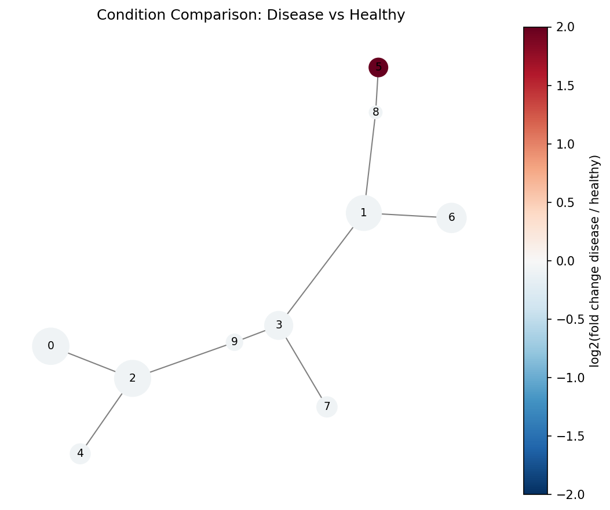
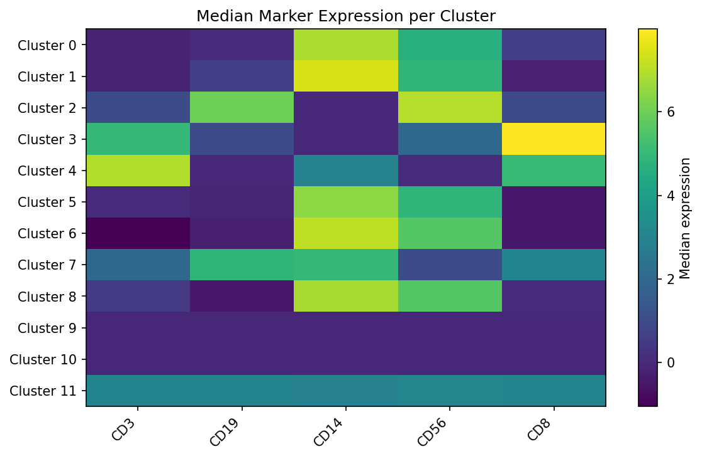

# densitree

**A reference Python implementation of the SPADE algorithm for high-dimensional cytometry and single-cell data.**

SPADE (Spanning-tree Progression Analysis of Density-normalized Events) extracts cellular hierarchies from high-dimensional single-cell data by combining density-dependent downsampling, agglomerative clustering, and minimum spanning tree construction.

---

## Why densitree?

- **scikit-learn compatible** -- `fit()` / `fit_predict()` API, works with numpy arrays and pandas DataFrames
- **Extensible pipeline** -- swap any step (density estimation, clustering, etc.) via the `BaseStep` interface
- **Dual visualization** -- static matplotlib and interactive plotly backends
- **Reproducible** -- deterministic results with `random_state` parameter
- **Well-tested** -- comprehensive unit and integration test suite
- **Pure Python** -- no R or MATLAB dependency

## Quick Example

```python
import numpy as np
from densitree import SPADE

X = np.random.default_rng(0).normal(size=(1000, 10))

spade = SPADE(n_clusters=20, downsample_target=0.1, random_state=42)
spade.fit(X)

# Cluster labels for all 1000 cells
print(spade.labels_)

# Per-cluster statistics
print(spade.result_.cluster_stats_)

# Visualize the SPADE tree
spade.result_.plot_tree(color_by=0, backend="matplotlib")
```

## Example outputs

### Tree colored by marker expression

Nodes are sized by cell count. Color shows median CD3 expression -- high (yellow) in T cell clusters, low (purple) elsewhere.


### Condition comparison

Red nodes are enriched in the disease condition, blue in healthy. Cluster 5 (dark red) contains a rare population expanded in disease.



### Cluster heatmap

Median marker expression per cluster reveals distinct cell populations.



### Interactive visualization

densitree also supports interactive plotly trees -- hover for cluster details, zoom and pan.

<iframe src="assets/images/tree_interactive.html" width="100%" height="500" frameborder="0"></iframe>

## Installation

```bash
pip install densitree
```

Or from source:

```bash
git clone https://github.com/fuzue/densitree.git
cd densitree
pip install -e ".[dev]"
```
