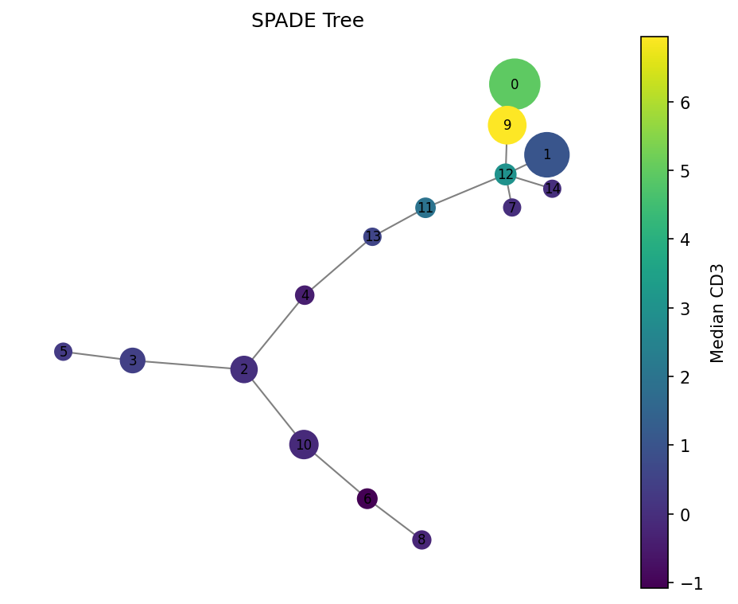
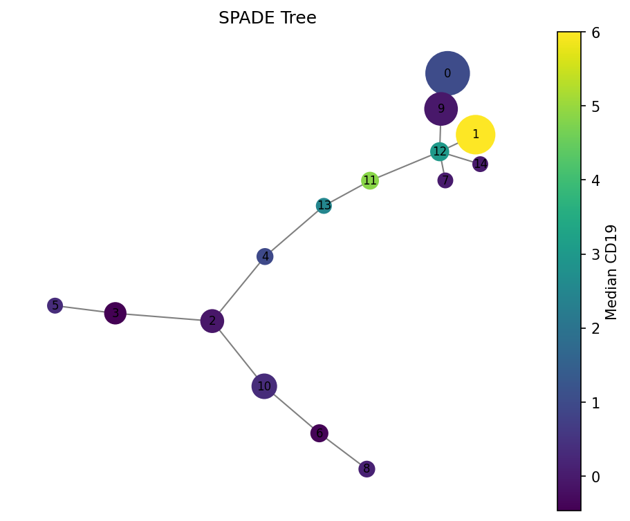

Tutorial: Flow Cytometry Analysis with densitree
=================================================

This tutorial walks through a complete SPADE analysis of CyTOF data using the Levine_32dim benchmark dataset.

Setup
-----

.. code-block:: python

   import numpy as np
   import pandas as pd
   import matplotlib
   matplotlib.use("Agg")  # use interactive backend if in a notebook
   import matplotlib.pyplot as plt
   from densitree import SPADE

Load data
---------

densitree works with numpy arrays or pandas DataFrames. Here we load the Levine_32dim benchmark dataset:

.. code-block:: python

   # If you have readfcs installed:
   import readfcs
   adata = readfcs.read("Levine_32dim.fcs")
   df = adata.to_df()

   # Select marker columns (exclude metadata like Time, DNA, etc.)
   markers = [c for c in df.columns if c.startswith("CD") or c == "HLA-DR" or c == "Flt3"]
   X = df[markers]
   print(f"Data: {X.shape[0]} cells, {X.shape[1]} markers")

Run SPADE
---------

For CyTOF data, use arcsinh transform with cofactor 5:

.. code-block:: python

   spade = SPADE(
       n_clusters=50,           # overcluster for tree exploration
       downsample_target=0.1,   # retain 10% of cells
       knn=10,                  # k for density estimation
       transform="arcsinh",
       cofactor=5.0,            # CyTOF standard
       random_state=42,
   )
   spade.fit(X)

   print(f"Clusters: {len(np.unique(spade.labels_))}")
   print(f"Tree nodes: {spade.result_.tree_.number_of_nodes()}")
   print(f"Tree edges: {spade.result_.tree_.number_of_edges()}")

Explore results
---------------

Cluster statistics
~~~~~~~~~~~~~~~~~~

.. code-block:: python

   stats = spade.result_.cluster_stats_
   print(stats.head(10))

   # Find the largest and smallest clusters
   print("\nLargest clusters:")
   print(stats.nlargest(5, "size")[["size"]])

   print("\nSmallest clusters (potential rare populations):")
   print(stats.nsmallest(5, "size")[["size"]])

Visualize the tree
~~~~~~~~~~~~~~~~~~

.. code-block:: python

   # Color by CD3 expression
   fig = spade.result_.plot_tree(color_by="CD3", size_by="count", backend="matplotlib")
   fig.savefig("spade_tree_cd3.png", dpi=150, bbox_inches="tight")

.. code-block:: python

   # Color by CD19 (B cell marker)
   fig = spade.result_.plot_tree(color_by="CD19", size_by="count", backend="matplotlib")
   fig.savefig("spade_tree_cd19.png", dpi=150, bbox_inches="tight")

Interactive exploration with plotly
~~~~~~~~~~~~~~~~~~~~~~~~~~~~~~~~~~~~~

.. code-block:: python

   fig = spade.result_.plot_tree(color_by="CD3", backend="plotly")
   fig.write_html("spade_tree_interactive.html")
   # or fig.show() in a notebook

.. raw:: html

   <iframe src="../assets/images/tree_interactive.html" width="100%" height="500" frameborder="0"></iframe>

Work with the tree directly
~~~~~~~~~~~~~~~~~~~~~~~~~~~~~

.. code-block:: python

   import networkx as nx

   tree = spade.result_.tree_

   # Find hub clusters (high degree = many connections)
   degrees = sorted(tree.degree, key=lambda x: x[1], reverse=True)
   print("Hub clusters:", degrees[:5])

   # Find clusters connected to a specific node
   neighbors = list(tree.neighbors(0))
   print(f"Cluster 0 is connected to: {neighbors}")

   # Get the path between two clusters (differentiation trajectory?)
   path = nx.shortest_path(tree, source=0, target=25, weight="weight")
   print(f"Path: {path}")
   print("Markers along path:")
   for node in path:
       median = tree.nodes[node]["median"]
       print(f"  Cluster {node}: size={tree.nodes[node]['size']}")

Export results
--------------

.. code-block:: python

   # Add cluster labels to original data
   df_out = X.copy()
   df_out["spade_cluster"] = spade.labels_
   df_out.to_csv("annotated_cells.csv", index=False)

   # Export cluster statistics
   spade.result_.cluster_stats_.to_csv("cluster_stats.csv")

   # Export tree for external tools
   nx.write_graphml(spade.result_.tree_, "spade_tree.graphml")

Parameter tuning tips
----------------------

.. list-table::
   :header-rows: 1
   :widths: auto

   * - If you see...
     - Try...
   * - Too many small clusters
     - Decrease ``n_clusters``
   * - Rare populations missing
     - Increase ``downsample_target`` (e.g., 0.2) or decrease ``knn``
   * - Noisy tree with many short edges
     - Increase ``n_clusters`` to spread out populations
   * - Very slow
     - Decrease ``downsample_target`` (e.g., 0.05)
   * - For fluorescence flow cytometry
     - Use ``cofactor=150.0`` instead of 5.0
